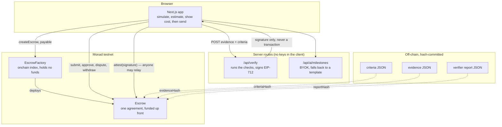
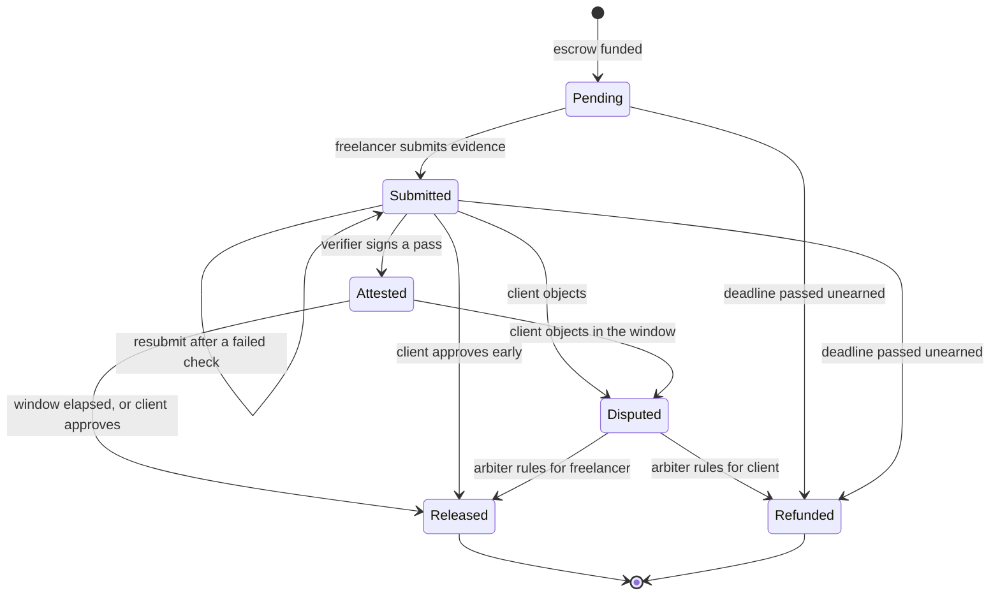
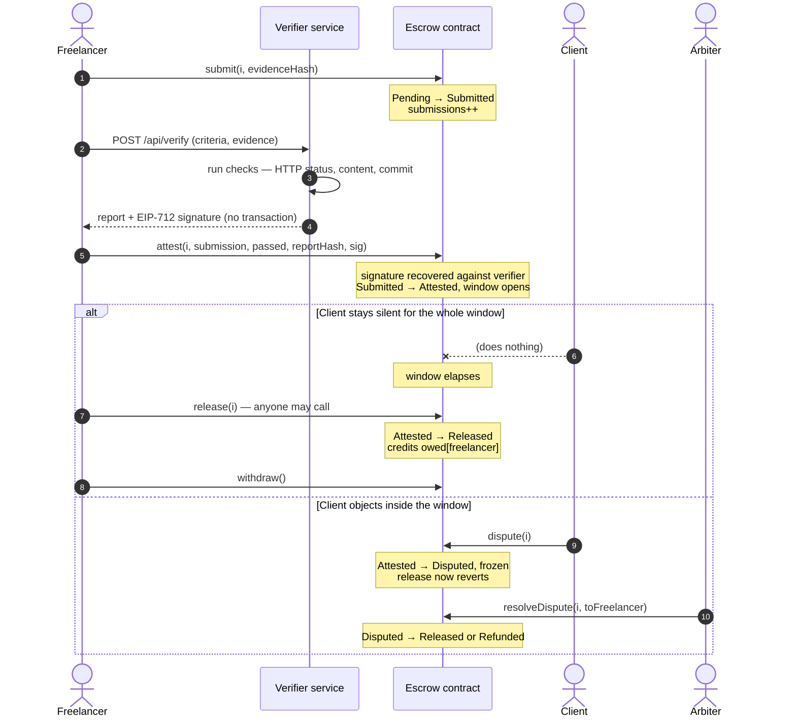
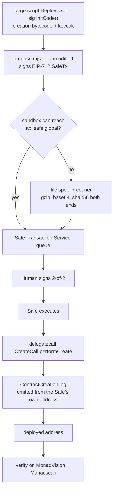

# MonEscrow

**Turn any freelance agreement into a programmable escrow.**

The client funds the whole job up front. Each milestone releases as it is shown to be done.
A verifier *proposes* that a milestone passed — it never decides: a passing attestation
opens a challenge window, the client's silence releases the money, the client's objection
freezes it for an arbiter.

Not a marketplace. No discovery, no profiles, no bidding. The deliverable is a link you
paste into Discord.

> Monad testnet only. Not audited. Do not use with real funds.

---

## The problem

```
CLIENT      "If I pay first, what if the freelancer disappears?"
FREELANCER  "If I work first, what if the client doesn't pay?"
```

Escrow breaks that deadlock, but it replaces it with a harder question: **who decides the
work is done?** Hand that to a human and the freelancer waits on someone's inbox. Hand it
to a bot and you have let software move somebody's money on its own judgement.

MonEscrow's answer is to make the bot's verdict a *proposal with a deadline*:

```
verifier says PASS  ─→  challenge window opens
                          │
             client silent├─────────────→  anyone can release the funds
                          │
            client objects└─────────────→  frozen, arbiter rules
```

The freelancer gets paid without chasing anyone. The client keeps a veto. Nothing
automated ever moves money that a human could not stop in time.

---

## How it fits together

Nothing between the browser and the chain is trusted with money. The verifier signs; the
contract decides what a signature is worth.



The dotted lines are the cheap part of the design: the documents live off-chain and only
their hashes go on-chain, so the agreement is tamper-evident without anyone paying to
store it. The solid line from `/api/verify` back to the browser is the important one —
**the verifier hands back a signature and nothing else.** It never broadcasts, never holds
gas, and never touches the escrow. Whoever wants the milestone to progress pays for it.

---

## Repo layout

```
monescrow/
├── docs/
│   ├── 00-PLAN.md          why the work is split three ways, dependency graph, gates
│   ├── 01-INTERFACES.md    C1–C10 — the frozen seams between workers
│   ├── 02-ALFA.md          Claude Desktop — chain, deploy, integration, docs
│   ├── 03-CLAUDE-CODE.md   Claude Code taskforce — tests, verifier, AI, frontend
│   └── 04-CHATGPT.md       ChatGPT studio — brand, assets, adversarial review
├── contracts/              Foundry — Escrow, EscrowFactory, tests, Deploy script
├── web/                    Next.js frontend + verifier and AI API routes  (in progress)
├── assets/                 brand, empty states, 9-slide deck
├── tools/relay/            Safe proposal relay for a sandbox with no chain access
└── deploy/                 deployment records and demo parameters
```

**Start at `docs/00-PLAN.md`.** Every worker reads `docs/01-INTERFACES.md` before writing a
line, because those ten contracts are what let three runtimes that cannot see each other's
files produce halves that fit.

---

## Status

| Piece | State |
|---|---|
| `Escrow.sol` + `EscrowFactory.sol` | written, compiling, formatted |
| Cancun opcode support on Monad | **verified on the live chain**, not assumed |
| Attestation security tests | **12/12 passing** |
| Clean-clone build | **proven** — `make setup && make gate` from a tree with no `lib/` |
| Reproducible build | **method proven** — pristine tree hashes identically to the working tree |
| Deploy script + Safe relay | done; full proposal dry run completed end to end |
| Verifier keypair | generated; address published, key server-side only |
| Brand, empty states, deck | Studio — delivered and checked against the C9 manifest |
| Remaining contract tests | Taskforce, 9 files in flight |
| Verifier service, AI parser, frontend | Taskforce |
| Deploy + verify on explorers | Alfa, gated on the test suite |

### What is already proven

The attestation surface is where this design lives or dies, so it was tested first. All of
these are covered and passing:

- a forged signature from any other key is rejected
- the freelancer cannot sign their own pass
- a pass for submission #1 dies the moment the freelancer resubmits
- a pass for milestone 0 cannot release milestone 1
- a pass for one escrow cannot be replayed onto another with identical parameters
- flipping `passed` or swapping the report hash invalidates the signature
- a *failing* attestation changes no state, so it can never be used to strand a milestone
- anyone may relay a valid attestation — the signature is the authority, not the sender

---

## Contracts

```
Escrow                                    EscrowFactory
  accept / cancel                           createEscrow  (payable, client = msg.sender)
  submit(i, evidenceHash)                   escrows / escrowCount / getEscrows
  attest(i, submission, passed,             escrowsOf(party)   ← client and freelancer
         reportHash, signature)             isEscrow
  approve(i) / release(i) / dispute(i)
  resolveDispute(i, toFreelancer)
  reclaim(i)  /  withdraw()
```

Milestone lifecycle:



### The attestation, and why it is only a proposal

This is the sequence the whole product rests on. Read the two branches at the bottom
together — they are the same mechanism, and which one fires is entirely the client's
choice.



Step 7 is the one people miss: `release` is callable by **anyone**. An honest freelancer
never has to chase the client for a signature, and the client never has to remember to
approve anything — silence is a decision, and it favours the person who did the work.

Step 6 is where the security lives. The signature is checked against the escrow's own
EIP-712 domain, which pins the chain id and this contract's address, and against
`submission` and `evidenceHash`, which pin it to one exact deliverable. A pass cannot be
moved to another milestone, another escrow, another chain, or a later resubmission.

Design notes worth knowing before reading the source:

- **Money is never pushed.** Release and refund credit `owed[party]`; the party calls
  `withdraw()`. One reentrancy surface instead of six.
- **A milestone inside its challenge window survives the deadline.** `reclaim` deliberately
  excludes `Attested` — work proven in time is earned even if the clock runs out during the
  objection period.
- **Funding is exact.** Milestone amounts must sum to `msg.value`, so the contract can
  always pay out and no milestone is ever unfunded.
- **`ReentrancyGuardTransient`** (EIP-1153) instead of the classic guard, because the live
  chain was probed and supports `TSTORE` — and on Monad a cold `SSTORE` costs 8,100 gas
  versus Ethereum's 2,100, with the user paying the gas *limit* rather than the gas used.

---

## Run the contracts

```bash
cd contracts
forge install --no-git foundry-rs/forge-std@v1.16.2
forge install --no-git OpenZeppelin/openzeppelin-contracts@v5.7.0
forge test -vv
```

Or in one command:

```bash
cd contracts
make setup     # pinned deps
make gate      # fmt + sizes + tests, everything G1 requires
```

Versions are pinned deliberately — the deployed bytecode must stay reproducible against
what gets verified on the explorers. Verified from a pristine tree with no `lib/`:
`make setup && make gate` compiles, formats clean, and passes 12/12, producing runtime
bytecode byte-identical to the working tree.

`forge` itself is pinned by agreement rather than config, because Foundry cannot pin its
own version and `forge fmt` output shifts between releases: **1.7.1, commit `4072e487`**.
Upgrading it rewrites files nobody touched and takes the gate red for everyone at once.

---

## Deployment

The factory is not deployed from a private key. It goes out through a 2-of-2 Safe, which
means the deployment is strictly serial and needs a human signature in a browser — the
worst possible thing to parallelise and the reason it belongs to one worker.



Two traps on that path, both of which cost time if you meet them for the first time on
deploy day:

- **The receipt's `contractAddress` is `null`.** Always. The Safe delegatecalls
  `CreateCall`, so it never does a `CREATE` itself. The deployed address is in the
  `ContractCreation` log — and because it is a *delegatecall*, that log is emitted from
  the Safe's address, not from `CreateCall`'s. Filtering by `CreateCall` finds nothing.
- **A truncated bytecode paste still deploys.** ~16 KB of hex crossing a console and a
  clipboard produces a validly-shaped transaction that deploys *different code*, verifies
  against nothing, and surfaces much later. Hence `tools/relay/`, which hashes every
  payload at both ends.
