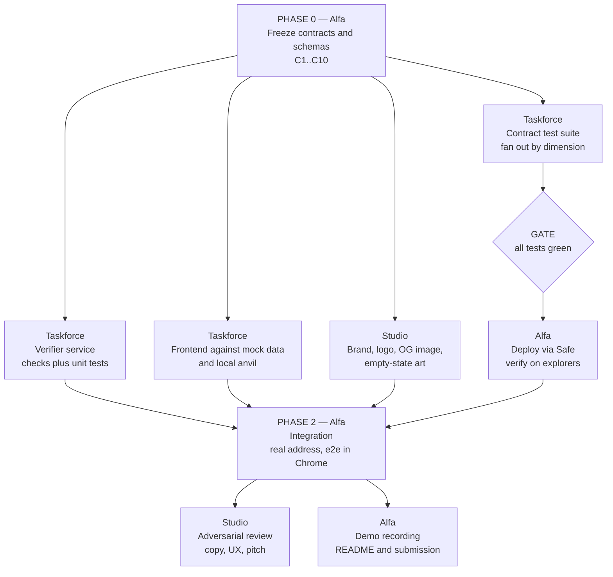

# MonEscrow — build plan and why the work is split this way

**Product.** Turn any freelance agreement into a programmable escrow. The client funds the
whole job up front; each milestone releases as it is shown to be done. A verifier
*proposes* that a milestone passed — it never decides. A passing attestation opens a
challenge window; client silence releases the money, a client objection freezes it.

**Not** a marketplace. No discovery, no profiles, no bidding. The deliverable is a link you
paste into Discord.

---

## Who is on the team

| Worker | Runtime | Can do what the others cannot |
|---|---|---|
| **Alfa** | Claude Desktop (Cowork) | Drive a real Chrome, hit the live chain, sign through the Safe, record the demo |
| **Taskforce** | Claude Code + subagents | Fan out to many agents at once on independent, locally-verifiable work |
| **Studio** | ChatGPT | Generate images and brand assets; review as someone who did not write the code |

## The rule used to assign every task

Three axes decide everything:

1. **Does it need a live browser or the real chain?** Only Alfa has that.
2. **Is it independent and verifiable by a local command?** Then it fans out — Taskforce.
3. **Is the output an artifact no code can produce?** Then it is Studio.

Applied honestly, that produces some non-obvious placements:

- **Foundry tests go to Taskforce, not Alfa.** Each test file is independent, touches no
  shared state, and `forge test` is an objective oracle. That is the textbook shape for
  parallel agents — ten test files can be written by ten agents simultaneously and merged
  without anyone reading anyone else's work.
- **Deployment goes to Alfa, not Taskforce.** Deploying through a 2-of-2 Safe is *strictly
  serial* — nonce 0, then 1, then 2 — and each step needs a human signature in a browser.
  It is the worst possible candidate for fan-out and the best possible fit for the one
  worker holding the browser.
- **Integration goes to Alfa.** Whoever can click the running app and watch a real
  transaction land is the one who finds "it compiles but does nothing".
- **Review goes to Studio.** A reviewer who wrote the thing is worth much less than one who
  did not. Studio never touches `contracts/` or `web/src/`, which is exactly why its review
  is useful.

## The one thing that makes parallel work possible

Three workers who cannot see each other's files must agree on the **seams** before anyone
starts. Otherwise you get three well-built halves that do not fit.

So Phase 0 is a single-owner job: freeze the interfaces. Those are written down as ten
numbered contracts in [`01-INTERFACES.md`](01-INTERFACES.md). Nobody changes one without
announcing it, because every change invalidates work already in flight.

## Dependency graph

Two things worth reading off that graph:

- **The frontend does not wait for deployment.** It builds against a local anvil address
  and swaps in the testnet address at integration. Blocking the UI on a multisig signature
  would waste the whole parallel window.
- **Deployment does wait for the tests.** Shipping unverified bytecode to a public chain and
  then finding a bug means redeploying and re-verifying. The gate is cheap; skipping it is
  not.

## Status right now

| Piece | State | Owner |
|---|---|---|
| `Escrow.sol`, `EscrowFactory.sol` | written, compiling, Cancun verified against live Monad | Alfa — done |
| Attestation security tests | **12/12 passing** — forgery, replay across submission/milestone/escrow, self-signing | Alfa — done |
| Remaining test dimensions | not started — 8 files listed in `03-CLAUDE-CODE.md` | Taskforce |
| Verifier service | not started | Taskforce |
| AI brief parser (BYOK) | not started | Taskforce |
| Frontend | not started | Taskforce |
| Deploy + verify | blocked on test gate | Alfa |
| Brand and assets | not started | Studio |

## Phase gates

A phase does not end because time passed. It ends when its gate is objectively true.

| Gate | Condition |
|---|---|
| **G0 — interfaces frozen** | `01-INTERFACES.md` merged; all three workers briefed |
| **G1 — contracts proven** | `forge test` green, `forge build --sizes` under limit, no `TODO` in `contracts/src` |
| **G2 — deployed** | Factory + one Escrow verified on MonadVision and Monadscan; address in `deploy/` |
| **G3 — integrated** | full happy path clicked through in a real browser against testnet |
| **G4 — submittable** | README with diagrams, demo recording, live link or run instructions |

## What we are deliberately not building

No marketplace, no profiles, no bidding, no chat, no reputation, no token, no mainnet.
Every one of those is a way to spend the whole hackathon and demo nothing.
